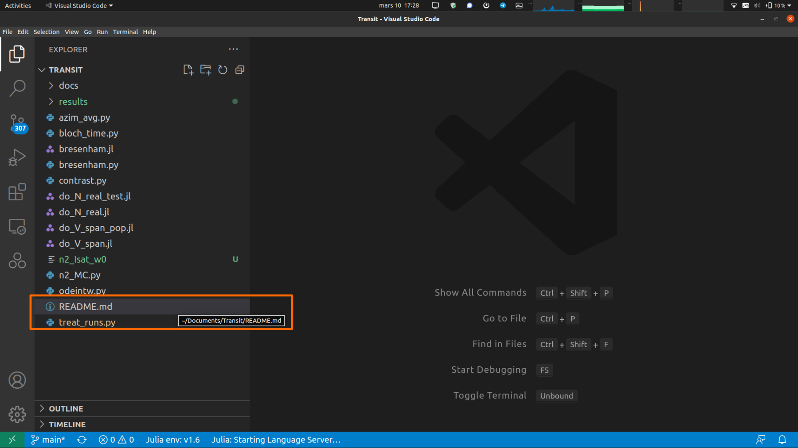
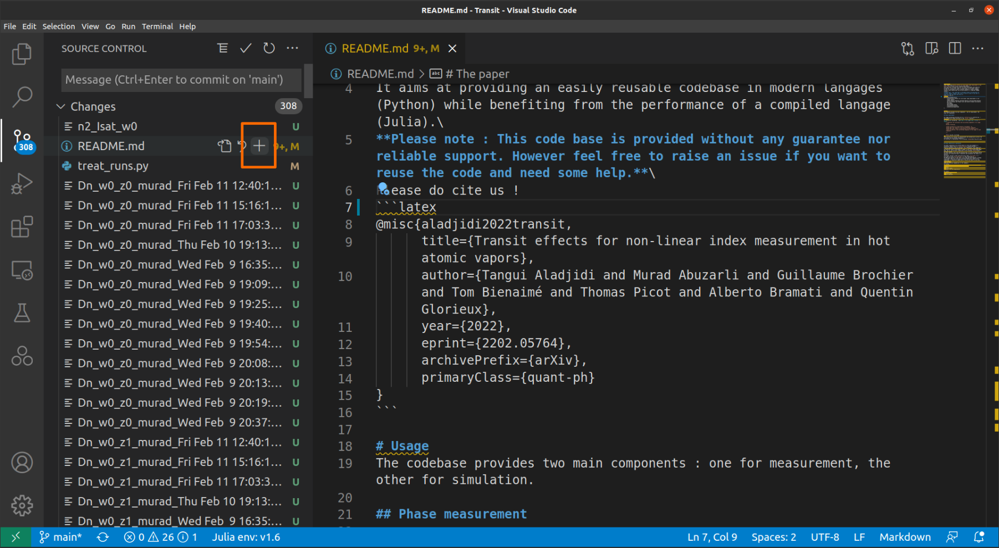
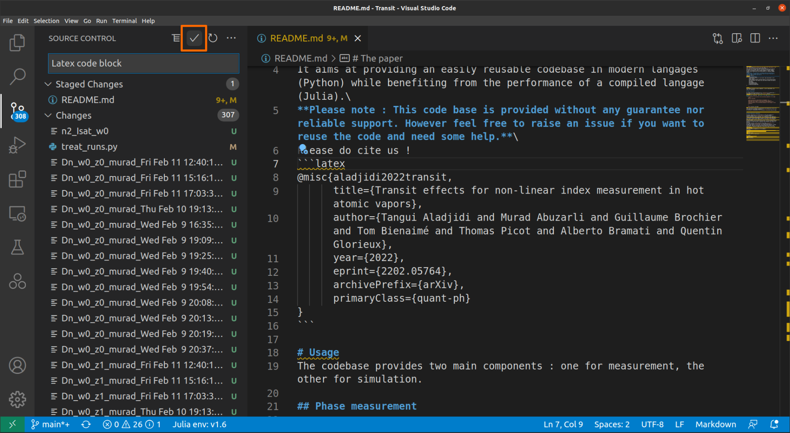
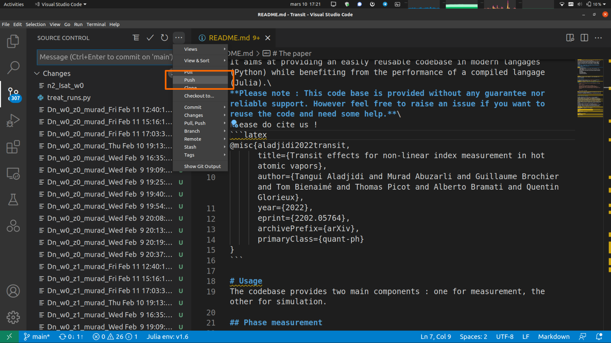
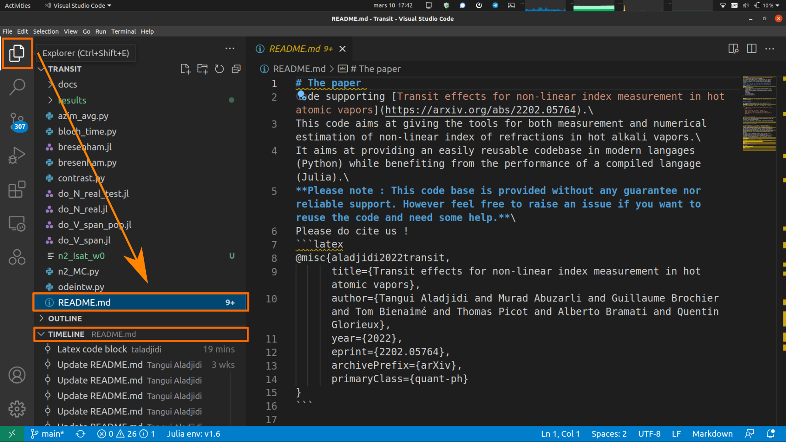

--- 
title: Welcome to the programming section!
description: 'Learn the basics for programming tools.

Links to tutorials: '
---

---
Learn the basics for programming tools.
---
Here are the programming tools that are commonly (mandatory) used in the team.


## SSH

The Secure SHell (SSH) protocol is used to securely access remote servers using a public key and private key. 
The public key acts like a lock–anyone can see it–but only the holder of that corresponding private key and unlock it.
When connecting to a remote server that has your public key, your identity is verified by checking if your private key (which only you should have) 
can unlock your public key. Keeping your private key secure is crucial, as anyone with access to your private key can impersonate you and 
access servers that have your public key.

### Key generation

In order to use SSH authentication, you need SSH keys. In this section of the tutorial, we will show you how to generate SSH keys on Windows, Mac, and Linux.

??? Windows

    If you are using Windows 10, you will need to install the OpenSSH client before continuing with the following steps.
    - Go to **Setting** > **Apps** > **Optional Features**.
    - Click on **Add a feature**.
    - Search for OpenSSH client and install it.
    - Note: Windows 11 has the OpenSSH client installed by default.

  
??? Linux

    If you are using Linux, ssh is probably already installed. You can check by running
    - ```
    $ ssh -v
    usage: ssh [-46AaCfGgKkMNnqsTtVvXxYy] [-B bind_interface] [-b bind_address]
             [-c cipher_spec] [-D [bind_address:]port] [-E log_file]
             [-e escape_char] [-F configfile] [-I pkcs11] [-i identity_file]
             [-J destination] [-L address] [-l login_name] [-m mac_spec]
             [-O ctl_cmd] [-o option] [-P tag] [-p port] [-R address]
             [-S ctl_path] [-W host:port] [-w local_tun[:remote_tun]]
             destination [command [argument ...]]
         ssh [-Q query_option]
    ```

  If it's not, you need to install it using your distribution package manager, refer to your distribution documentation for more information


Generate the keys
- Run `ssh-keygen -t ed25519 -C "email@example.com"`

You will be prompted for a filename/location to save your keys. Press Enter to select the default.
- `$ ssh-keygen -t ed25519 Generating public/private rsa key pair. Enter file in which to save the key (/home/<username>/.ssh/id_rsa): `

You will be prompted to create a passphrase for your SSH keys. Make sure you remember this passphrase, as you will need it each time you use your SSH key.
The password you type won't be shown on the terminal, but don't fret it will still be recorded
- `Enter passphrase (empty for no passphrase):`

You will be asked to re-enter your passphrase. Do so and press Enter.
- `Enter same passphrase again:`

You will see output similar to this, indicating that your SSH keys have been generated.
- ```
Your identification has been saved in /home/<username>/.ssh/id_rsa
 Your public key has been saved in /home/<username>/.ssh/id_rsa.pub
 The key fingerprint is:
 SHA256:YwOXM1rI+idGlqftABaj7gRtvV9rwWcXGm21NeFSVXw <username>@<hostname>
 The key's randomart image is:
 +---[RSA 3072]----+
 |               +*|
 |     . . .    +.E|
 |    o + *  . o +o|
 | . o + * o. + o  |
 |. + = =.S  + .   |
 | + . * =oo+ .    |
 |  o . * ++ .     |
 | o   o *..       |
 |  .   ..o        |
 +----[SHA256]-----+
```

We want to access Léon, which is the server used to store your experiment data. We need to share our public key (aka the shared lock) with it :
- `ssh-copy-id -i "path/to/key.pub" username@patriot.lkb.upmc.fr`

Finally, you can connect to the remote server
- `ssh username@patriot.lkb.upmc.fr`


## Github
[Github](https://github.com/) will be our best friend for code managing. Here everybody in the team share their code and get feedback from others. Also it will allows you to save your code and have backup (just in case).\
You need to ask a permanent staff member to add your GitHub account to the Quantum-Optics-LKB *organization* in order to gain access to the team's repositories.\
When you put code on GitHub, you share it with the rest of the team. This should encourage you to **document very thoroughly** your projects such that everyone can use your code without spending weeks reverse-engineering it.\
The canonical way we suggest you document your code (a part from in code comments made such as docstrings etc ...) is to include a `README.md` file in your repository. GitHub suggests you this by default. Many examples can be found on the teams GitHub such as the [Piezo](https://github.com/Quantum-Optics-LKB/Piezo) repo.\
<alert type="warning">**YOU MUST DOCUMENT AND COMMENT ALL YOUR CODES, ALWAYS**</alert>
*But how does GitHub work ?*\
[Git](https://en.wikipedia.org/wiki/Git) is the underlying program that handles code version control. It was initially developped by Linus Torvalds to handle the growing number of developpers on the Linux kernel. It is meant to allow a decentralized way to handle contributions to a code base, and to be able to keep track of changes.\
[GitHub](https://en.wikipedia.org/wiki/GitHub) on the other hand is a cloud based storage solution for your code, that integrates Git in order to handle version control.\
**In order to install `git` on your computer follow [this](https://github.com/git-guides/install-git) tutorial.**\
Once you installed `git` you can `git clone` a repository (here the [Transit](https://github.com/Quantum-Optics-LKB/Transit) repo as an example) as follows:
```shell
git clone git@github.com:Quantum-Optics-LKB/Transit.git
```
or over https
```shell
git clone https://github.com/Quantum-Optics-LKB/Transit.git
```
This will copy a folder named `Transit` with hidden `.git` / `.gitignore` folders within it that essentially list all changes and what files to ignore. \
Now, let's say you want to add to the `Transit` codebase, the simplest way to go about doing this is to open the folder in VSCode :



Let's open the documentation file `README.md` to edit as indicated by the orange rectangle. We edit it and once we are happy with the change, we **stage** the changes as follows :



We can then **commit** the changes (without forgetting to enter a name for the commit):


To finally send the changes on the remote side of the repository (on GitHub), we **push** the changes :


You can then check that everything went well by looking at the timeline pane :


## Python

The most used language in the team. Mandatory to interface with the lab's equipment. \
You can install python throught [Conda-forge](https://conda-forge.org/) or if you are a nerd [MAMBAFORGE](https://mamba.readthedocs.io/en/latest/installation/mamba-installation.html).

Unless you need specific installs for a project and you *know exactly what you are doing*, this is the safest most complete Python install. 

- **Linux**, it is more than recommanded to add the Python version of conda/mamba to your `PATH` by running `conda init` at the end of the install (explained in the installer's messages). Once this is done, you should see an additional `(base)` in your command shell :
```bash
(base) user@computer:~$
```
This indicates that the `base` conda environment is activated.

- **Windows**, this last step is **discouraged** ! Windows handle very differently Python installs, and you should not try to mess with it. Just do whatever the installer tells you to do.
You should then use "Anaconda prompt" if you need to install stuff with `pip` or `conda`.
But if you need to sepcify the PATH you can enter `env` in windows search. Then `environment variable`, select `PATH` and modify and add the adress of your anaconda installation like `C:\Users\[user_name]\anaconda3\Scripts`.
    
- **Mac**, it's your problem cowboy !
The following packages are used widely in the group and you should install them as well through `pip` : `opencv-python` (imports as `cv2`): `pyfftw`, `cupy` (see CUDA section below), `scikit-image`, `pyvisa` (for VISA communication with scopes and other instruments), `pythonnet` (.NET interface)


## VS Code

[VSCode](https://code.visualstudio.com/): the world's most used code editor : not for nothing. In this editor you will be able to run any language you want but also write your papers in Latex or your lab book in Markdown. 

### Link your github account

Vscode allows you to link vscode to your github account in order to commit your repository. You can follow the tuto for [github in vscode](https://code.visualstudio.com/docs/sourcecontrol/github)

### Create and change environement

You shoul create separate environement to avoid package conflict: science, image, web etc... Sometimes installing a new package using `pip` or `conda` will update force the update of other package. For example doing `pip install opencv-python` will force the update of numpy but the new version of numpy will not work with your version of matplotlib and then you have to downgrade numpy.....!
To create a new environement you can open a new terminal and use the command:
```bash
conda create -n <env-name>
```
and the environement:
```bash
conda activate <env-name>
```
Don't forget that the packages you've installed on one environment aren't necessarily on the one you've created. 


### Extensions

And you can add extensions to help you. Here a list of mandatory extensions :

- autoDocstring for Python: we strongly encourage you to activate the autoformatting on save. This means that VS Code will automatically make your code prettier when you save your file (access settings  by pressing <kbd>Ctrl</kbd> + <kbd>,</kbd> and then search "Format on save"). You can then choose a format provider if you're looking for specific rules.
- Jupyter and notebook: separate your code in cells and run them separately or organize your code as a notebook with markdown implemention
- Pylance
- Julia
- LaTex Workshop
- Markdown All in One
- markdownlint
- Github [copilote](https://github.com/features/copilot): help of an artificial intelligence. Copilote can automatically fill in the rest of your code, adapting to what you already coded. If your github account is eligible for Copilote, you can take advantage of it. As a student, you're almost forced to have it, since it's free! [student request](https://docs.github.com/en/education/explore-the-benefits-of-teaching-and-learning-with-github-education/github-education-for-students/apply-to-github-education-as-a-student).


Most of these extensions do not need any settings, but if you wish to, you can access those in the "Extensions" tab on the left of VS Code.\

## ChatGPT
- An Assistant for QuantumOptics Documentation
This guide is authored to help you navigate and utilize ChatGPT within the QuantumOptics documentation effectively. If you need access, please find the login credentials on the team's Mattermost channel.

---

Welcome to the QuantumOptics documentation portal, designed to offer precise and practical information on quantum optics. To enhance your experience, we've integrated the ChatGPT assistant, an intelligent tool that guides you through the documentation.

### Group account

You can acces the group chatgpt account with the login and password provided in the pinned message on the Daily Chatting channel on mattermost.

### Good practices

When you open a new chat


### How to Use ChatGPT:

1. **General Questions:** Ask ChatGPT for explanations on broad quantum optics concepts, technical details, or practical examples.
2. **Advanced Assistance:** For specific information (such as exact sections or calculations), ChatGPT can point you directly to the relevant documentation section or provide in-depth explanations.
3. **Interactive Guidance:** Use ChatGPT to get best practice suggestions, concept overviews, or links to complementary articles—all within the context of your inquiry.

Try ChatGPT now to simplify your journey through the documentation and deepen your understanding of quantum optics.

---

For any issues accessing ChatGPT, please refer to the Mattermost channel for updated login credentials.

## Mkdocs

For full documentation visit [mkdocs.org](https://www.mkdocs.org).

### Commands

* `mkdocs new [dir-name]` - Create a new project.
* `mkdocs serve` - Start the live-reloading docs server.
* `mkdocs build` - Build the documentation site.
* `mkdocs -h` - Print help message and exit.

### Project layout

    mkdocs.yml    # The configuration file.
    docs/
        index.md  # The documentation homepage.
        ...       # Other markdown pages, images and other files.


